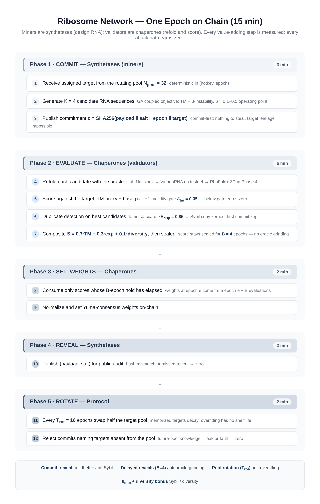

# Ribosome Network

**A Bittensor subnet for decentralized RNA inverse folding — miners are synthetases, validators are chaperones.**

Built for the [Bittensor Global Subnet Hackathon](https://hackquest.io) (Aug 22 – Oct 19, 2026).
Status: mechanism complete, 58 tests green, 20-epoch adversarial simulation evidence included.



## What works right now (no GPU, no chain)

```bash
pip install -r requirements.txt        # numpy, pytest (bittensor optional)

# 1. run the full test suite (mechanism + attack tests)
python -m pytest tests/ -q

# 2. run the adversarial simulation: 32 miners, 20 epochs, 4 attack types
python -m simulation.run_simulation --epochs 20 --out data/runs

# 3. drive the miner neuron standalone (mock mode, no bittensor needed)
python neurons/miner.py --mode mock --generator ga --epochs 3

# 4. evaluate a commit ledger with the validator neuron (mock mode)
python neurons/validator.py --mode mock --epochs 1 --out /tmp/weights.json
```

Expected simulation result (see `data/runs/summary.json`):

| strategy | mean TM | accepted | weight share |
|---|---|---|---|
| GA miner (honest) | 0.75 | 99% | **47%** |
| Stub miner (honest) | 0.54 | 83% | 28% |
| Sybil clone | 0.76 | **0%** (98% zeroed as duplicates) | **0.0%** |
| Lazy (drops reveals) | 0.49 | 75% | 5% |
| Leaker | 0.00 | **0%** (100% rejected) | 0.0% |

## Mechanism in one paragraph

Every 15 minutes each miner receives a target RNA structure from a rotating pool
(32 active, half replaced every 16 epochs), generates K = 4 candidate sequences,
and commits `SHA256(payload ‖ salt ‖ epoch ‖ target)` before seeing anything it
could exploit. Validators refold the candidates with an oracle (bundled Nussinov →
ViennaRNA → RhoFold+), score the best candidate against the target
(`0.7·TM + 0.3·exp`, validity gate δ_tm = 0.35), zero duplicates
(k-mer Jaccard ≥ 0.85, first commit kept), pay a diversity bonus (0.1 × mean
pairwise distance), seal scores for 4 epochs (no oracle grinding), then set
normalized Yuma weights. Full spec: [SPEC.md](SPEC.md).

## Repository map

```
ribosome/           mechanism package (pure Python, no bittensor import)
neurons/            miner.py / validator.py — mock + testnet modes
simulation/         offline adversarial harness + CLI
tests/              58 pytest cases (scoring, commit-reveal, duplicates,
                    rotation, delayed reveals, generators, end-to-end attacks)
data/targets/       pool_v1.json — 54 validated targets (32 active + reservoir)
data/paper/         β-ablation + OpenVaccine CSVs from the companion preprint
data/runs/          simulation logs (JSONL) + summary.json
docs/               charts, demo video script, 7-day plan, proposal PDF
tools/              pool manifest builder
```

## Testnet deployment

See [SPEC.md § 10](SPEC.md#10-testnet-deployment-phase-3). Requires
`pip install bittensor`, a registered hotkey and a testnet connection;
the neuron code paths are identical to mock mode by design.

## Provenance

Mechanism from *The Ribosome Network* preprint (miners-as-synthetases,
chaperone validation, θ_dup = 0.85, w_div = 0.1, N_pool = 32, T_rot = 16,
B = 4). Miner technology from *Stability-Aware mRNA Inverse Design via Coupled
Forward-Model-Guided Search* (coupled GA, β-Pareto operating point, XGBoost
forward model MCRMSE 0.356).
